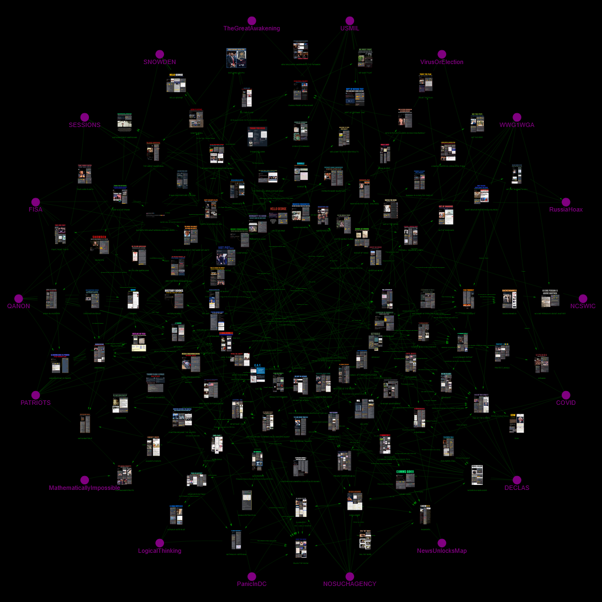

# Interactive Network Graph Visualization

An interactive web application that visualizes complex relationships between nodes using D3.js network graphs. Built with Flask, NetworkX, and Gravis for dynamic, force-directed graph rendering.

## 📸 Visualization Preview



*Interactive force-directed graph with cyberpunk theme: black background, purple keyword nodes on outer circle, image thumbnails in center, and green connecting edges.*

## 🌟 Features

- **Interactive Visualization**: Zoom, pan, and hover over nodes to explore relationships
- **Dynamic Force Layout**: Automatic node positioning using D3.js force simulation
- **Cyberpunk Theme**: Black background, purple keyword nodes, green edges, image thumbnails
- **Two Node Types**:
  - **Graphic Nodes**: Visual content with linked images and social media posts (center)
  - **Keyword Nodes**: Conceptual nodes positioned on the outer circle
- **Data-Driven Architecture**: 
  - All data externalized to JSON files
  - 87% code reduction through DRY principles
  - Easy to update without touching code
- **Performance Optimized**: 
  - Graph caching to avoid regeneration on every request
  - Optimized position calculations
  - Efficient rendering with Gravis/D3.js
- **Responsive Design**: Works across different screen sizes
- **Cache Control**: Proper HTTP headers to ensure fresh content delivery

## 📋 Requirements

- Python 3.10 or 3.11
- Flask 3.0.0+
- NetworkX 3.3
- Gravis 0.1.0
- Gunicorn 21.2.0+ (for production deployment)

## 🚀 Getting Started

### Installation

1. Clone the repository:
```bash
git clone <your-repo-url>
cd <repo-name>
```

2. Install dependencies:

```bash
pip install -r requirements.txt
```

### Running the Application

#### Development Mode

Run the Flask development server:

```bash
python main.py
```

The application will be available at `http://localhost:5000`

#### Production Mode

For production deployment, use Gunicorn:

```bash
gunicorn --bind=0.0.0.0:5000 --reuse-port main:app
```

## 📁 Project Structure

```
.
├── main.py                          # Main Flask application (426 lines)
├── main_old_backup.py               # Original code backup (3,108 lines)
├── data/
│   ├── nodes.json                   # 133 nodes with metadata
│   ├── edges.json                   # 235 active edges
│   ├── edges_keyword_circular_commented.json  # 16 commented edges
│   └── README_edges.md              # Edge data documentation
├── config/
│   └── graph_config.json            # Visualization configuration
├── templates/
│   └── index.html                   # Generated graph (auto-generated)
├── requirements.txt                 # Python dependencies
├── pyproject.toml                   # Poetry configuration
├── Procfile                         # Deployment configuration
├── README.md                        # This file
├── CLEANUP_SUMMARY.md               # Cleanup documentation
└── REFACTORING_SUMMARY.md           # Refactoring details
```

## 🎨 Configuration

The graph visualization can be customized by editing `config/graph_config.json`:

### Color Scheme (Cyberpunk Theme)
```json
{
  "colors": {
    "default_color": "black",
    "highlight_color": "green",
    "keyword_color": "purple",
    "background_color": "#000000"
  }
}
```

### Node Positioning
```json
{
  "positions": {
    "keyword_radius": 1177.1,
    "graphics_radius": 360.0,
    "graphics_interval": 5
  }
}
```

### Force Simulation Parameters
```json
{
  "visualization": {
    "many_body_force_strength": -1776.0,
    "links_force_distance": 107.00,
    "collision_force_radius": 100.00
  }
}
```

## 📊 Data Management

### Updating Nodes

Edit `data/nodes.json`:
```json
[
  {
    "graphicLabel": "YOUR LABEL",
    "graphicName": "unique_id",
    "xPostURL": "https://x.com/...",
    "xGraphicURL": "https://pbs.twimg.com/..."
  }
]
```

### Updating Edges

Edit `data/edges.json`:
```json
[
  {
    "source": "source_node_id",
    "target": "target_node_id",
    "label": "Relationship description"
  }
]
```

### Managing Commented Edges

Commented edges are stored in `data/edges_keyword_circular_commented.json`. See `data/README_edges.md` for restoration instructions.

## 🔧 API Documentation

### Main Routes

#### `GET /`
Serves the interactive graph visualization.

**Response**: HTML page with embedded D3.js graph

**Headers**:
- `Cache-Control: no-cache, no-store, must-revalidate`
- `Pragma: no-cache`
- `Expires: 0`

## 🔄 How It Works

1. **First Request**: 
   - Server loads nodes from `data/nodes.json` (133 nodes)
   - Server loads edges from `data/edges.json` (235 edges)
   - Calculates node positions using circular/interval algorithms
   - Creates D3.js interactive HTML output with Gravis
   - Caches the result in `templates/index.html`

2. **Subsequent Requests**:
   - Serves cached HTML for faster load times
   - Only regenerates if cache is missing

3. **Node Positioning**:
   - Keyword nodes: Circular layout on outer radius (1177.1 units)
   - Graphic nodes: Interval-based layout on inner radius (360.0 units)
   - Force-directed layout for natural spacing

## 🚀 Performance Optimizations

- **Caching**: Graph generated once and cached
- **Lazy Loading**: Visualization only created when needed
- **Optimized Math**: Pre-calculated trigonometric values
- **Efficient Data Structures**: Dictionary-based node/edge storage
- **87% Code Reduction**: Data-driven architecture eliminates duplication

## 🐛 Troubleshooting

### Graph Not Displaying
- Check browser console for JavaScript errors
- Ensure `templates/` directory exists
- Verify all dependencies are installed
- Check that `data/nodes.json` and `data/edges.json` exist

### Performance Issues
- Graph generation is CPU-intensive for first load
- Consider pre-generating graph for production
- Use production-ready WSGI server (Gunicorn)

### Cache Issues
- Clear browser cache (Ctrl+Shift+R / Cmd+Shift+R)
- Delete `templates/index.html` to force regeneration
- Check server logs for generation status

### Data Issues
- Validate JSON syntax in `data/nodes.json` and `data/edges.json`
- Ensure all edge source/target IDs match actual node names
- Check `data/README_edges.md` for edge management documentation

## 📄 License

MIT License

Copyright (c) 2025 AREVEUR5117

Permission is hereby granted, free of charge, to any person obtaining a copy
of this software and associated documentation files (the "Software"), to deal
in the Software without restriction, including without limitation the rights
to use, copy, modify, merge, publish, distribute, sublicense, and/or sell
copies of the Software, and to permit persons to whom the Software is
furnished to do so, subject to the following conditions:

The above copyright notice and this permission notice shall be included in all
copies or substantial portions of the Software.

THE SOFTWARE IS PROVIDED "AS IS", WITHOUT WARRANTY OF ANY KIND, EXPRESS OR
IMPLIED, INCLUDING BUT NOT LIMITED TO THE WARRANTIES OF MERCHANTABILITY,
FITNESS FOR A PARTICULAR PURPOSE AND NONINFRINGEMENT. IN NO EVENT SHALL THE
AUTHORS OR COPYRIGHT HOLDERS BE LIABLE FOR ANY CLAIM, DAMAGES OR OTHER
LIABILITY, WHETHER IN AN ACTION OF CONTRACT, TORT OR OTHERWISE, ARISING FROM,
OUT OF OR IN CONNECTION WITH THE SOFTWARE OR THE USE OR OTHER DEALINGS IN THE
SOFTWARE.

## 👤 Author

**AREVEUR5117**

## 🤝 Contributing

Contributions, issues, and feature requests are welcome!

## ⭐ Show Your Support

Give a ⭐️ if this project helped you!

## 📮 Contact

For questions or support, please open an issue in the repository.

---

**Built with ❤️ using Flask, NetworkX, and D3.js**
